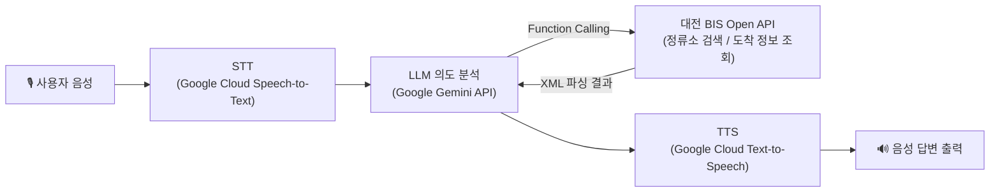

<div align="center">

# 🚌 대화형 버스 안내 AI 챗봇 (대화로路)

이 프로젝트는 대전광역시청을 중심으로 **버스 도착 정보**와 **최적 경로**를 음성으로 안내해 주는 AI 챗봇 시스템입니다.  
사용자의 음성을 인식(STT)하여 Google Gemini LLM으로 의도를 파악하고, 대전 BIS(버스 정보 시스템) API를 통해 실시간 데이터를 조회한 뒤, 음성(TTS)으로 답변을 제공합니다.
<br/>

### 🎬 프로젝트 시연 영상 (클릭 시 YouTube 이동)
<a href="https://www.youtube.com/watch?v=awujKkmEsgY" target="_blank">
  
</a>

<br/>

</div>

---

## ✨ 주요 기능

- **음성 대화 인터페이스**: 마이크를 통해 질문을 듣고 스피커로 답변을 말합니다.
- **실시간 버스 정보 조회**: 대전 BIS API와 연동하여 실제 버스 도착 정보를 제공합니다.
  - 특정 정류장의 버스 도착 정보 조회
  - 대전광역시청에서 특정 목적지까지 가는 직행 버스 검색
- **AI 기반 자연어 처리**: Google Gemini API를 사용하여 사용자의 자연어 질문을 이해하고 적절한 함수를 호출하거나 답변을 생성합니다.
- **단계별 예외 처리**: STT 시간 초과, API 사용량 한도 초과 등 각 구간에서 발생 가능한 오류를 개별적으로 감지하고 사용자에게 안내합니다.
- **처리 시간 모니터링**: STT / LLM / TTS 각 단계의 소요 시간을 실시간으로 로깅하여 성능 병목을 파악할 수 있습니다.

---

## 🏗️ 아키텍처

음성 입력부터 응답 출력까지 4단계 파이프라인으로 구성되어 있으며, `main.py`의 `Pipeline` 클래스가 전체 흐름을 조율합니다.



1. **STT** — `stt_module.py`가 PyAudio로 마이크 스트림을 열고 Google Cloud Speech-to-Text 스트리밍 API로 실시간 음성 인식을 수행합니다.
2. **LLM (의도 분석 및 함수 호출)** — `llm_module.py`가 Gemini(`gemini-2.5-flash`)에 Function Calling 도구(`get_bus_arrival_info`, `find_direct_bus_from_city_hall`)를 등록하고, 사용자의 질문 의도에 맞는 함수를 선택·호출합니다.
3. **외부 API 연동** — `bis_module.py`가 대전 BIS Open API에 요청을 보내 정류소 ID 검색 및 실시간 도착 정보를 XML로 응답받아 파싱합니다.
4. **TTS** — `tts_module.py`가 최종 응답 텍스트를 SSML로 감싸 Google Cloud Text-to-Speech로 합성하고, `mpg123`으로 재생합니다.

---

## 🛠️ 기술 스택

| 분류 | 기술 |
| --- | --- |
| 언어 | Python 3.x |
| AI / LLM | Google Gemini API (`gemini-2.5-flash`), Function Calling |
| 음성 인식 (STT) | Google Cloud Speech-to-Text (Streaming Recognition) |
| 음성 합성 (TTS) | Google Cloud Text-to-Speech (SSML, WaveNet) |
| 외부 데이터 연동 | 대전 BIS(버스 정보 시스템) Open API (REST / XML) |
| 오디오 입출력 | PyAudio, mpg123, ALSA (`amixer`) |
| 환경 설정 관리 | python-dotenv |
| HTTP 통신 | requests |

---

## ⚙️ 설계 및 운영 특징

- **환경 변수 기반 설정 관리**: API 키, 오디오 장치 인덱스, BIS API 엔드포인트 등 운영 환경에 따라 바뀔 수 있는 값을 `.env`와 `config.py`로 일원화하여 관리합니다.
- **계층별 예외 처리**: STT 시간 초과(`DeadlineExceeded`), 세션 종료(`OutOfRange`), Gemini API 사용량 초과(`ResourceExhausted`), BIS API 통신 오류 등 각 외부 연동 지점마다 예외를 개별적으로 처리하여 한 구간의 장애가 전체 시스템 중단으로 이어지지 않도록 설계했습니다.
- **리소스 생명주기 관리**: PyAudio 인터페이스를 전역으로 재사용하고, `atexit`을 통해 프로그램 종료 시 오디오 리소스를 자동으로 정리합니다.
- **성능 가시성 확보**: STT / LLM / TTS 각 단계의 처리 시간을 로그로 남겨 병목 구간을 쉽게 진단할 수 있도록 했습니다.
- **Linux 오디오 시스템 운영**: `amixer`를 통한 출력 볼륨 제어, `libasound2-dev`/`alsa-utils` 기반 오디오 장치 설정 등 실제 배포 환경(라즈베리파이 등 임베디드 리눅스)을 고려한 시스템 구성을 포함합니다.

---

## 📂 프로젝트 구조

| 파일명 | 설명 |
| --- | --- |
| `main.py` | 프로그램의 진입점. STT, LLM, TTS 과정을 조율하고 메인 루프를 실행합니다. |
| `config.py` | API 키, 오디오 설정(샘플 레이트, 장치 인덱스), BIS API URL 등 환경 변수를 관리합니다. |
| `bis_module.py` | 대전 BIS Open API와 통신하여 정류소 ID 검색 및 도착 정보를 파싱(XML)합니다. |
| `llm_module.py` | Google Gemini API를 설정하고, 시스템 프롬프트 및 도구(Function Calling)를 정의합니다. |
| `stt_module.py` | Google Cloud Speech-to-Text를 사용하여 실시간 음성 인식을 처리합니다. (PyAudio 사용) |
| `tts_module.py` | Google Cloud Text-to-Speech를 사용하여 텍스트를 음성으로 변환하고 재생합니다. (`mpg123` 사용) |

---

## 🛠️ 설치 및 환경 설정

이 프로젝트는 **Python 3.x** 환경에서 실행되며, 오디오 입출력을 위한 시스템 패키지가 필요합니다.

### 1) 시스템 패키지 설치 (Linux/Ubuntu 기준)

오디오 재생 및 녹음을 위한 라이브러리를 설치해야 합니다.

```bash
sudo apt-get update
sudo apt-get install python3-pyaudio mpg123 libasound2-dev alsa-utils
```

### 2) Python 라이브러리 설치

필요한 Python 패키지를 설치합니다.

```bash
pip install google-cloud-speech google-cloud-texttospeech google-generativeai python-dotenv pyaudio requests
```

### 3) 환경 변수 설정 (`.env`)

프로젝트 루트 경로에 `.env` 파일을 생성하고 아래 내용을 채워주세요.

```ini
# 대전 공공데이터 포털 API 키 (BIS)
DAEJEON_API_KEY=your_daejeon_bis_api_key_here

# BIS API 엔드포인트 (기본값)
URL_SEARCH_STATION=http://openapitraffic.daejeon.go.kr/api/rest/busRouteInfo/getStaionByRouteAll
URL_GET_ARRIVAL=http://openapitraffic.daejeon.go.kr/api/rest/arrive/getArrInfoByStopID

# Google Gemini API 키
GEMINI_API_KEY=your_gemini_api_key_here

# Google Cloud 서비스 계정 키 경로 (json 파일 경로)
# STT 및 TTS 사용을 위해 필요합니다.
GOOGLE_APPLICATION_CREDENTIALS="path/to/your/service-account-file.json"
```

### 4) 오디오 장치 설정

`config.py` 파일에서 마이크 장치 인덱스를 확인하고 본인의 환경에 맞게 수정해야 할 수 있습니다.

```python
# config.py
MIC_DEVICE_INDEX = 1  # 사용 중인 마이크 장치 번호로 변경 (PyAudio 기준)
```

---

## 🚀 실행 방법

모든 설정이 완료되면 아래 명령어로 프로그램을 실행합니다.

```bash
python main.py
```

프로그램이 시작되면  
`"안녕하세요! 대전 버스 안내 시스템 대화로입니다."`  
라는 음성과 함께 대기가 시작됩니다.

---

## 📝 사용 예시

- "대전시청에서 유성온천역 가는 버스 알려줘."
- "갤러리아 타임월드 정류장에 버스 언제 와?"
- "종료해줘." (프로그램 종료)

---

## ⚠️ 주의 사항

- 이 프로젝트는 **대전광역시청**을 주요 출발지로 가정하고 로직이 구성되어 있습니다.  
  (예: `find_direct_bus_from_city_hall`)
- Google Cloud API (STT, TTS) 및 Gemini API는 사용량에 따라 과금될 수 있습니다.

---
